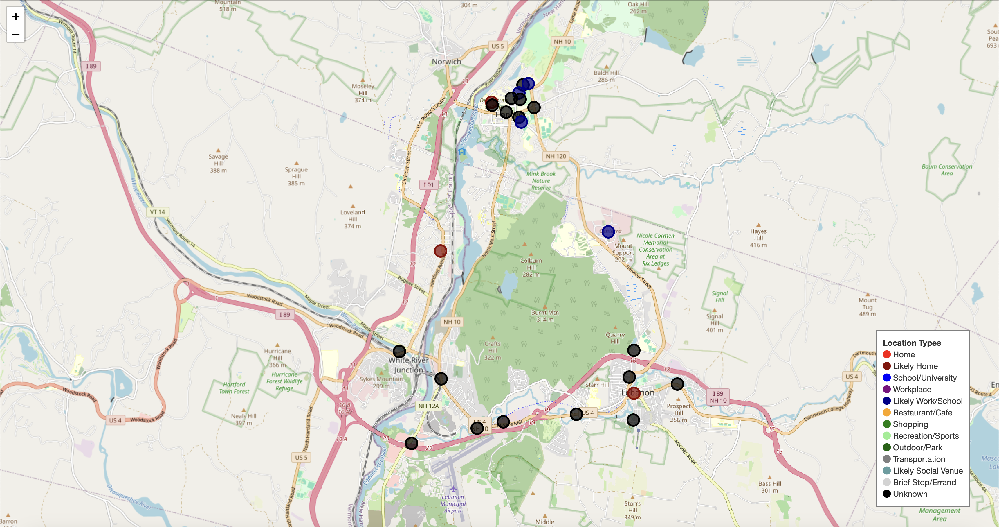

# UVA-CS4501-GPS-Location-Analysis

This repository contains a tool for analyzing GPS location data to infer significant locations in a subject's life. It was developed as part of a CS4501 Data Privacy project at UVA.

## Overview

The GPS Location Analysis project processes location data to identify and classify significant places in a user's life. Using clustering algorithms and temporal analysis, it can determine frequent locations like homes, workplaces, and other commonly visited places without requiring explicit labeling.

Key features include:
- Automated identification of significant locations through DBSCAN clustering
- Temporal pattern analysis to understand when locations are visited
- Optional integration with Google Places API for location classification
- Visualization of movement patterns and location importance
- Privacy-focused analysis that protects user identity

## Data Source

This project uses data from the StudentLife dataset, which is a large, longitudinal dataset collected from 48 Dartmouth undergraduate and graduate students over a 10-week spring term. The dataset includes over 53 GB of continuous data, 32,000 self-reports, and pre-post surveys. Importantly, the dataset is anonymized, protecting the privacy of the participants in the study.

For this project, we specifically analyzed the GPS location data extracted from this dataset.

## How to Use

### Prerequisites

- Python 3.7+
- Required packages: pandas, numpy, matplotlib, folium, sklearn, seaborn, geopy

### Setting Up the Data

1. Download the GPS data from the StudentLife dataset.
2. Extract `gps.zip` in the project root directory. This will create a `gps` directory containing the user GPS files.

### Running the Analysis

1. Open the Jupyter notebook `gps_location_analysis.py`.
2. Execute the cells in order to:
   - Load and evaluate user data quality
   - Select the best users for detailed analysis
   - Identify significant locations through clustering
   - Visualize user locations and movement patterns
   - Analyze temporal patterns of visits
   - Optionally classify locations using Google Places API
   - Create final reports and visualizations

## Data Plots Description & How to Interpret Them

The analysis generates various visualizations to help understand location patterns:

### Interactive Location Maps

- **User Location Maps**: Interactive folium maps showing all GPS points for a user as a heatmap, with significant locations highlighted as red circles.
  

- **Labeled Location Maps**: Enhanced maps with color-coded locations based on their classified type (home, work, shopping, etc.).

### Temporal Analysis

- **Temporal Heatmaps**: Show the distribution of location visits by day of week and hour of day. Darker colors indicate more frequent visits during that time.
- **Hourly & Daily Distribution**: For specific locations, these plots show when a particular place is visited most often.

### Classification Results

- **Location Type Pie Charts**: If location classification is enabled, these charts show the distribution of different types of places the user visits.
- **Classification Confidence**: Visualizes how confident the system is in its location classifications.

### Example Interpretations

- **Home Detection**: Locations frequently visited in evenings and on weekends, with long duration stays.
- **Work/School**: Locations visited primarily during weekday business hours.
- **Brief Stops**: Locations with short-duration visits distributed throughout the week.

## File Structure

## License

This project is licensed under the MIT License - see the LICENSE file for details.
